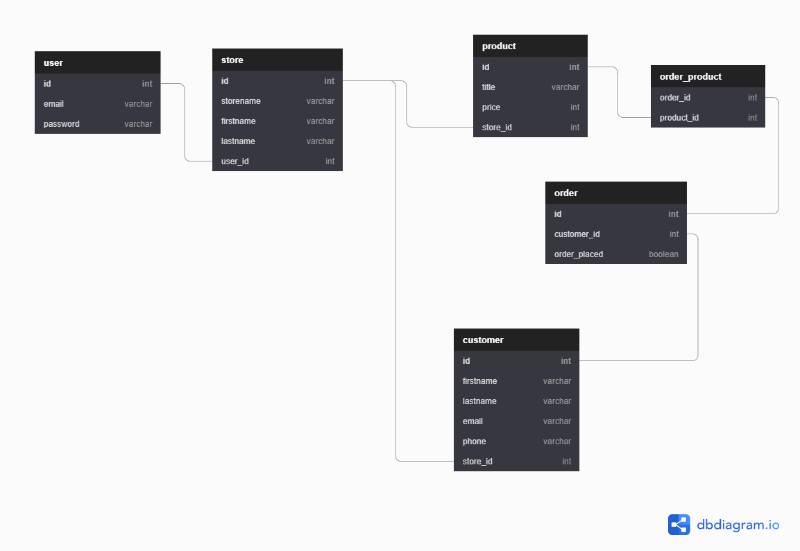

# Shopify - Advance Abandoned Cart Feature

<https://github.com/HarryTranAU/shopify_feature>

##### Harry Tran (T3A3)

## Scope

---

#### **What is Shopify?**

Shopify is a commerce platform that allows anyone to set up an online store and sell their products. Merchants can also sell their products in person with Shopify POS(Point of Sale).

---

#### **What is an Abandoned Cart?**

Abandonment is an ecommerce term used to describe a visitor on a web page who leaves that page before completing the desired action. Examples of abandonment include shopping cart abandonment, referring to visitors who add items to their online shopping cart, but exit without completing the purchase.

---

#### **Structure**

Note: This is my personal interpretation of the structure using personal experience and public information, this is by no means a representation of Shopify's actually data structure.

- The Merchant/Seller would create a `user`
- A `user` can create one `store` (one-to-one)
- A `store` can have many `products` and `customers` (one-to-many)
- An `order` can have many `products` and `products` can belong to many `orders` (many-to-many)
- `orders` and `products` are associated through a join table `orders_products`

---

#### **Abandoned Cart Implementation**e

The Abandoned Cart will be implemented through an additional property to the order table called `order_placed`. Using database joins, the abandoned cart customers can be targeted through joining customer details with orders that have not been placed(`order_placed`set to `False`).

---

#### **ERD**

[External DBDigram.io Link](https://dbdiagram.io/d/5feec11d80d742080a34b954)



---

## Requirement R2

**Discuss how the application will handle the privacy of user data within the system, and how security features of the frameworks you are utilising will assist to mitigate security concerns.**

**Bcrypt**

In this application, Bcrypt will be used to hash the passwords registered to the database. In the event, the database has breached the password is still unusable without the original hashing password.

Hashing is preferred over encryption because encryption is a two-way function, where the encrypted password can be decrypted. Whereas, hashing is a one-way function. With a properly designed algorithm, there is no way to reverse the hashing process.

**JWT**

JWT is used for authorization and authentication purposes in this application. The use of JWT can allow a user to create, read, update, and delete resources from their own stores, but not other user's stores.

**Marshmallow**

Marshmallow is used for object serialization and deserialization in this application. When configured properly, Marshmallow is able to validate data as it is being received. Example: data type validators such as Integers and Strings provide Marshmallow with information about what type of data is being expected.

**SQLAlchemy**

SQLAlchemy is an object-relational mapper (ORM) that bridges database relations into objects. This allows the application to communicate with the database without using raw SQL queries, preventing possible avenues for SQL injections. A specific example has been found that using the filter method is susceptible to SQL injections. However, in combination with input validation this SQL injection line of attack can be prevented.

**AWS (specifically Private Subnets)**

Hosting the database on a private subnet on AWS is another way to secure the data of the application. The structure of this application will require the database to be hosted on a private subnet that isn't associated with a routing table that directs traffic to an internet gateway. We will be accessing the private subnet by using a bastion host on a public subnet. EC2 instances hosted on the same VPC are able to communicate with one another. Allowing the bastion host to communicate with the database on the private subnet.

---

## Requirements R3

**Discuss how you will address the following obligations as a developer:**
- **professional obligations (delivering the project on time, being explicit about ongoing maintenance of the system)**
- **ethical obligations: ensuring that the application conforms with ethical codes of conduct approved by industry**
- **legal obligations: that you have assessed whether the application is subject to any legal regulation, if none, consider any privacy implications**

#### **Professional**

**Documentation**

For a developer, documentation is a must. Its main focuses are development, maintenance, and knowledge transfer to other developers. Successful documentation will make information easily accessible and help new users learn quickly. The primary medium used for documentation is code comments/type hints and the readme file.

**Testing**

Testing is important since it discovers defects/bugs before the delivery to the client, which guarantees the quality of the software. It makes the software more reliable and easy to use. Thoroughly tested software ensures reliable and high-performance software operation. This application takes advance of the python `unittest` module for testing purposes.

**Maintenance**

Maintenance is important because it ensures the software is kept up-to-date in terms of security. Software development is also a fast-changing landscape where new technologies allow for different solutions and more efficient solutions. This application will take advantage of GitHub actions to create and maintain the code through a CI/CD pipeline.

#### **Ethical**

**Protecting User's information**

Developers must do everything in their power to protect the user's information. Examples include using Bcrypt to hash passwords, and hosting the database on private subnets to prevent public access.

**Use of safe software**

Malicious software is not only a threat to end-users. Developers must also vet the packages and software they choose to use in their development process. The packages used in this application are widely known and used and obtained through safe and legal means.

#### **Legal**

**Data Rights**

Data rights have been a big topic in the last few years. The best example would be the General Data Protection Regulations (GDPR) drafted by the European Union. The GDPR was passed in 2016 and went into effect in Spring 2018.

The GDPR requires all companies to ask for consent from customers before they process data. In addition, they are required to collect and store that data anonymously – and must inform consumers if their data has been potentially compromised in a breach.

This application gives the merchant/user an option to create/read/update/delete customer data in the database.

**Terms and Conditions**

Terms and conditions are used for drawing boundaries for the use of an application. Should a user misuse the application and disregard the terms and conditions. The application owner or regulator can remove/ban the user.

Specifically, for this application, my terms and conditions would approve or deny a user's store based on the products they wish to add. In Shopify's TOC they specifically state prohibited and restrict items user's cannot sell. E.g. Alcohol, Tobacco, Cigarettes, Fireworks, Firearms and Weapons, Solvents, and Pharmaceuticals.

---

## Installation (Linux)

Install Python and git

```
sudo apt-get update
sudo apt-get install git
sudo apt-get install python3
```

Git clone and Open Folder

```
git clone https://github.com/HarryTranAU/shopify_feature.git
cd shopify_feature
```

Optional: Virtual Environment (Recommended)

```
sudo apt-get install python3-venv
python3 -m venv venv
source venv/bin/activate
```

Install Pip/requirements

```
sudo apt-get install python3-pip
pip install -r requirements.txt
```

Setup Postgresql

```
https://github.com/Ctrain68/EC2_postgres_sql_guide
```

Setup .env (.env.example provided when cloned)

Replace {variables} with your environment variables

```
DB_PASSWORD= {database password}
FLASK_ENV=development
FLASK_APP=main.py
DB_URI= postgresql+psycopg2://{database user}:{database password}@{ip}:{port}/{database name}
DB_URI_TEST=s
JWT_SECRET_KEY= {secret key}

AWS_ACESS_KEY_ID= {id}
AWS_SECRET_ACESS_KEY_ID= {id}
AWS_S3_BUCKET= {id}
```

Program Start

```
flask run
```

---

## OpenAPI

Endpoints documented using OpenAPI 3.0.3.

[Interactive UI](https://petstore.swagger.io/?url=https://raw.githubusercontent.com/HarryTranAU/shopify_feature/master/docs/endpoints.yml)

---